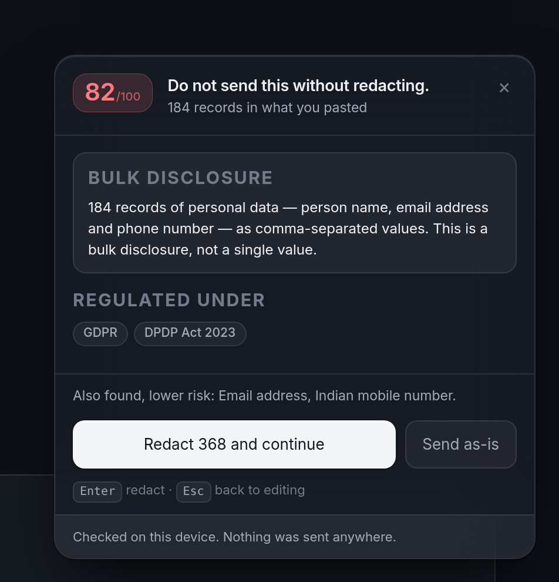

<div align="center">

# Chhanni

**छन्नी** — *a sieve*

### Your prompt leaves your machine the instant you press Enter.<br>Chhanni looks at it first.

**`99.88%` precision · `92` detectors · `0` network permissions**



</div>

---

**77% of employees paste into AI tools. 34.8% of what they paste is sensitive —
up from 11% in 2023. 82% of it goes through personal accounts.**
([Cyberhaven, 2026](https://www.cyberhaven.com/blog/sensitive-data-flowing-into-ai-tools))

Not careless people. Tired people, at 11pm, debugging something — because the
fastest way to get help is to paste the whole thing.

Chhanni reads it first, on your device, and gives you one number.

## It is not only for engineers

The common version of this tool scans for API keys. That is **32.8%** of what
actually leaks. The rest is customer data, board material, contracts and HR
records — and a regex over `AKIA` sees none of it.

| You are | You paste | Chhanni says |
|---|---|---|
| **Support / Ops** | A customer export from the admin panel | **82/100** — *184 records of personal data — name, email and phone. This is a bulk disclosure, not a single value.* `GDPR` `DPDP Act` |
| **Founder / CEO** | A board update before the announcement | **93/100** — *Legally privileged material. Possible inside information.* `SEC` `SEBI` `UK MAR` `Legal privilege` |
| **HR** | A compensation review | **79/100** — *Compensation information ×3. Health information ×2.* `GDPR` `HIPAA` `DPDP Act` |
| **Engineer** | A failing deploy's `.env` | **88/100** — *Long-lived IAM key for AWS account 5810-3995-4779 — decoded offline from the key itself.* |
| **Finance** | A model with ARR and runway | **71/100** — *Company financials with figures attached.* |
| **Legal** | A memo marked privileged | **90/100** — *Privilege can be waived by disclosure to a third party. An AI provider is a third party.* |

Then it offers to **redact and continue** — because the model never needed your
real key, or your customers' real emails, to answer the question.

## The one feature that changes the conversation

A pattern scanner reports a pasted customer export as *"312 email addresses"*.
True, useless, and nobody reads 312 findings.

Chhanni detects the **shape** of the data — including when the headers are
`c1,c2,c3`, by classifying columns from their values — and reports one thing:

> **184 records of personal data** — person name, email address and phone
> number — as comma-separated values. **This is a bulk disclosure, not a single
> value.**

That is the difference between an incident and a notifiable breach with a
72-hour clock, and it is the sentence a non-engineer acts on.

## Measured, not asserted

Every product in this category claims accuracy. **None publish a number.**

The only public figures come from academic work on secret scanners
([Rahman et al., 2023](https://arxiv.org/pdf/2307.00714)):

| Tool | Precision | Recall |
|---|---|---|
| GitHub Secret Scanner | 75% | — |
| Gitleaks | 46% | 88% |
| TruffleHog | — | 52% |
| "Commercial X" | 25% | — |
| **Chhanni** | **99.88%** | **99.54%** |

No tool in that study has both. Reproduce ours in one command:

```console
$ node bench/run.js
  precision   100.0%   241 true / 0 false positives
  recall      100.0%   0 missed
  46,206 byte document scanned in 5.8ms (8 MB/s), 92 detectors
```

4,247 cases, ten seeds, seeded PRNG so no real credential is committed here.
Method and **what the numbers do not say** in
**[docs/BENCHMARK.md](docs/BENCHMARK.md)** — including the honest limit: a check
digit can never reach zero false positives, because ~1 in 10 random numbers of
the right length passes one.

## Why it is right so much more often

Because a tool that cries wolf gets turned off. Six independent filters, each
allowed to reject:

```
candidate → prefilter → pattern → check digit → benign shape → context word → overlap → finding
```

| | |
|---|---|
| **Check digits** | Luhn, Verhoeff (Aadhaar), mod-97 (IBAN), mod-36 (GSTIN), mod-11 (CPF/CNPJ), mod-89 (ABN), CRC32 (GitHub) |
| **Issuer ranges** | Luhn alone accepts ~1 in 10 random numbers. A card must also start where a network actually issues, *at a length it issues* — which is what stops a 15-digit IMEI being called a payment card |
| **Benign shapes** | UUIDs, git SHAs, sha256 digests, epoch timestamps, `API_KEY=your-api-key-here` |
| **Required context** | Nine digits are nine digits until something says "SIN" |
| **Offline decoding** | The **AWS account number is recovered from the access key itself** — base32 and a bit shift, no API call. `alg:none` JWTs escalate to critical, because that is a signature bypass |

**92 detectors. 24 prove the match; the other 68 match a prefix nothing else
uses and are labelled `shape`, not `proof`, everywhere they appear.**

Coverage is global: Aadhaar, PAN, GSTIN, IFSC, UPI, and Indian DL/passport/voter
ID alongside CPF/CNPJ (BR), SIN (CA), NINO (UK), ABN/TFN (AU), EU VAT, ISIN,
IMEI, SSN and IBAN — plus ~45 vendor credentials across cloud, source, AI,
payments and platform.

## It reads your attachments, and fixes them

People do not only paste secrets — they **attach** them. A dragged `.env` never
touches the composer, so a composer-only scanner sees nothing.

Chhanni intercepts drops and file pickers, reads text-like files locally, and
offers something no other tool does: **attach a redacted copy instead.** A new
file, same name, same type, secrets replaced — and everything the model needs to
actually help you left intact.

## It makes no network call

Not "we don't store your data". There is no `fetch` in the extension. The
manifest requests **one** permission — `storage`, for your settings.

A test fails the build if any shipped module references `fetch`,
`XMLHttpRequest`, `sendBeacon`, `WebSocket` or `EventSource`. Even the font is
bundled locally rather than fetched from Google, because a webfont request would
tell a third party you are being shown a warning.

Findings carry a masked preview and a one-way hash; `--json` strips the matched
value entirely. Someone will fork this and add telemetry — the fork should be
safe by construction.

## Install

```console
git clone https://github.com/SanamBhanuPrakash/Extension chhanni && cd chhanni
node scripts/build.js
```

`chrome://extensions` → Developer mode → **Load unpacked** → `extension/`.
Firefox: `about:debugging` → **Load Temporary Add-on** → `dist/firefox/manifest.json`.

**CLI** — no install, zero dependencies:

```console
node bin/chhanni.js scan .          # exit 0 clean, 1 findings, 2 blocking
node bin/chhanni.js redact < prompt.txt
node bench/run.js --failures
```

```sh
# .git/hooks/pre-commit — the same rules that guard your chat box
git diff --cached --name-only -z | xargs -0 node bin/chhanni.js scan --quiet
```

**Library**: `import { scan, redact } from 'chhanni'`. Node ≥ 20, same module
runs in the browser.

## Publishing it yourself

**US$5 once, total.** Chrome Web Store charges a one-time $5 developer fee and
covers Chrome, **Brave**, Opera, Arc and Vivaldi — they all install from it.
Firefox AMO and Microsoft Edge Add-ons are **free**. Store-by-store requirements,
the data-use disclosures, and why this extension is unusually easy to get through
review are in **[docs/PUBLISHING.md](docs/PUBLISHING.md)**.

## Documentation

| | |
|---|---|
| [ARCHITECTURE](docs/ARCHITECTURE.md) | Layered module graph, the three interception flows, the precision stack, storage split, costs |
| [BENCHMARK](docs/BENCHMARK.md) | Method, per-seed results, and the limits of the claim |
| [THREAT-MODEL](docs/THREAT-MODEL.md) | Trust boundaries, seven threats, explicit not-covered list |
| [PRIOR-ART](docs/PRIOR-ART.md) | Who did this first, who sells it, what this lacks |
| [ROADMAP](docs/ROADMAP.md) | Where the exposure actually is, and what ships next |
| [PUBLISHING](docs/PUBLISHING.md) | Store requirements, fees, listing copy |
| [DECISIONS](docs/DECISIONS.md) | Twelve decision records, each with its cost |
| [PRIVACY](PRIVACY.md) | The policy the stores require |

## What it does not do

- **No ML or NER.** A name or address in ordinary prose is invisible to a
  pattern engine. [Casper](https://arxiv.org/abs/2408.07004) has an ML layer;
  this does not. Largest gap, and it is not close — see the roadmap.
- **This idea is not new.** Casper published the architecture in 2024;
  **LayerX sold to Akamai for ~$205M in July 2026.** The gap that is real is
  that nobody publishes accuracy.
- **Binary attachments pass untouched.** A screenshot of your dashboard is not read.
- **Only the sites in the manifest.** A new AI product ships every week.
- **It is advisory.** "Send as-is" exists on purpose. A guardrail, not an
  enterprise DLP control, and it should not be sold as one.
- **It names regulations; it does not make you compliant.**

## Tests

```console
$ node --test test/*.test.js
# tests 51
# pass 51
```

Checksums against known-good and known-bad vectors, explicit false-positive
tests, a prefilter-equivalence proof that the speed optimisation never changes
results, crash-safety across malformed input and 3 MB pastes, a test that a
throwing rule degrades only itself, and a benchmark gate that fails below 99%.

One caution the benchmark cannot give you: the GSTIN validator once had an
off-by-one that rejected **every real GSTIN**, and the benchmark scored 100%
throughout — the corpus generator called the same broken function. Only a
known-good published GSTIN caught it.

## Licence

MIT. Inter is bundled under the SIL Open Font License 1.1.
