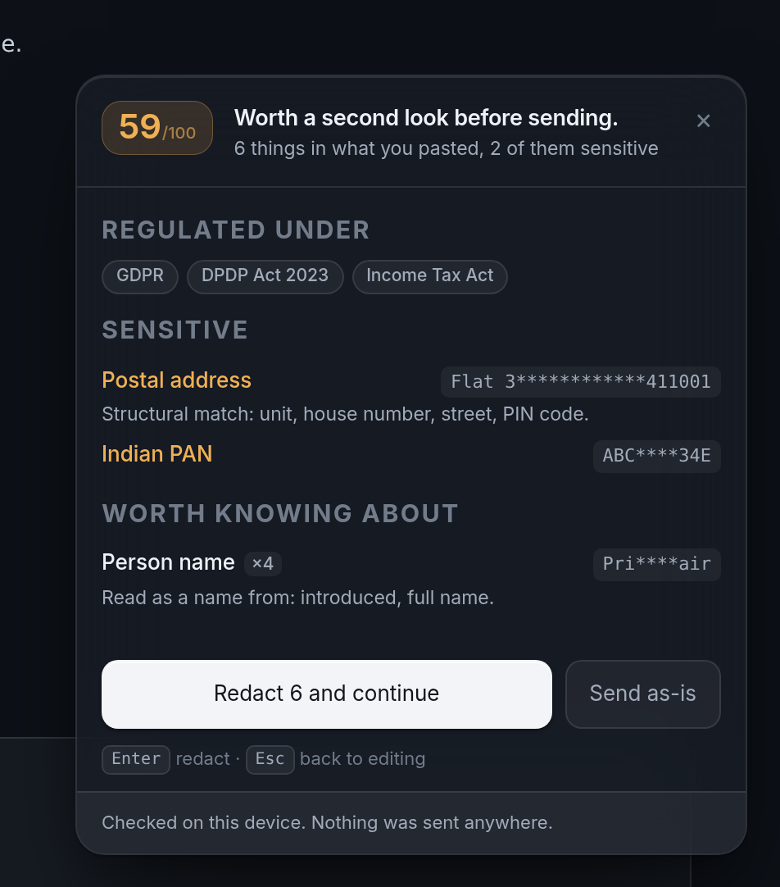
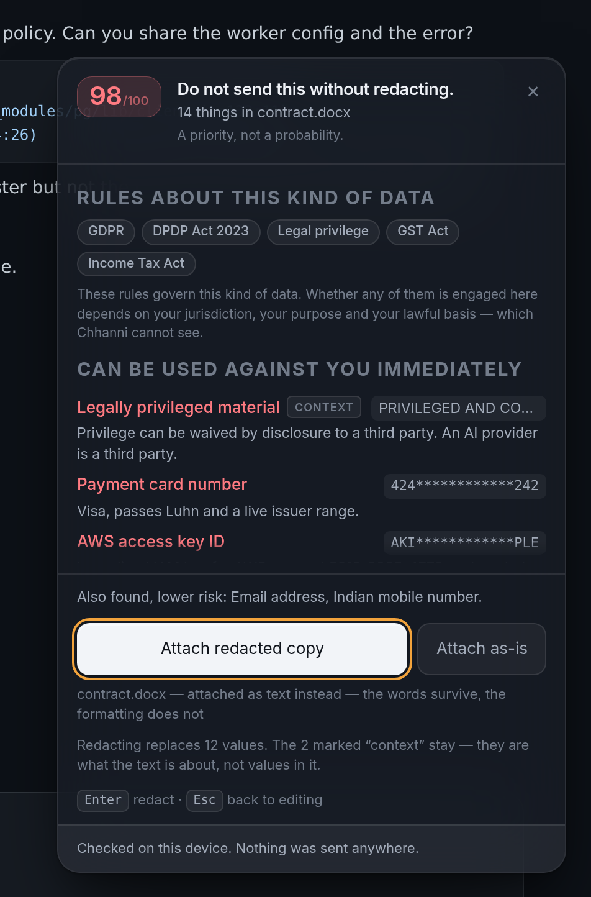
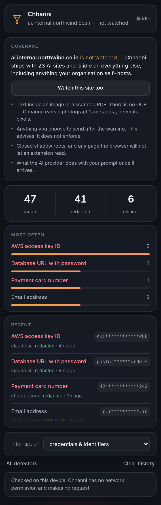

<div align="center">

# Chhanni

**छन्नी** — *a sieve*

### Your prompt leaves your machine the instant you press Enter.<br>Chhanni looks at it first.

**`102` detectors · `0.39%` alarm rate on 87,306 real files · reads DOCX/PDF/XLSX · `8` scripts · `0` network permissions**


</div>

---

**77% of employees paste into AI tools. 34.8% of what they paste is sensitive —
up from 11% in 2023. 82% goes through personal accounts.**
([Cyberhaven, 2026](https://www.cyberhaven.com/blog/sensitive-data-flowing-into-ai-tools))

Not careless people. Tired people, at 11pm, debugging something — because the
fastest way to get help is to paste the whole thing.

Chhanni reads it first, on your device, and gives you one number.

## Not only for engineers

The usual version of this tool scans for API keys. That is **32.8%** of what
actually leaks. The rest is customer data, board material, contracts and HR
records — and a regex over `AKIA` sees none of it.

| You are | You paste | Chhanni says |
|---|---|---|
| **Support** | A customer export from the admin panel | **90/100** — *184 records of personal data — name, email and phone. A bulk disclosure, not a single value.* `GDPR` `DPDP Act` |
| **Founder** | A board update before the announcement | **93/100** — *Legally privileged. Possible inside information.* `SEC` `SEBI` `UK MAR` |
| **HR** | A compensation review | **79/100** — *Compensation ×3. Health information ×2.* `HIPAA` `GDPR` |
| **Engineer** | A failing deploy's `.env` | **88/100** — *IAM key for AWS account 5810-3995-4779, decoded offline from the key itself.* |
| **Anyone** | An email about a customer | **58/100** — *Person name ×2. Postal address.* `GDPR` `DPDP Act` |
| **Anyone** | A web page pasted in for summarising | **critical** — *contains instructions aimed at an assistant. You are the carrier here, not the target.* |

Then it offers to **redact and continue** — because the model never needed your
real key, or your customers' real emails, to answer the question.

## It reads sentences, in eight scripts



Most personal data is not in a database export. It is in a sentence — and the
sentence is not always in English.

Chhanni ships a **21 KB logistic regression** (16,384 hashed character
features, trained on 30,675 names from 75 locales) for scripts that have case,
and a **10,237-name gazetteer** for the ten scripts that do not: Arabic,
Hebrew, Devanagari, Bengali, Tamil, Telugu, Thai, Han, Hangul, kana.

```console
$ node bench/ner.js
34 annotated documents · 13 of them hard negatives

  names      precision 97.8%   recall 100.0%   F1  98.9%
  addresses  precision 100.0%  recall 100.0%   F1 100.0%
```

**The honest part:** the classifier alone scores **F1 71.7%** and more training
does not move it. A Yoruba place name and a Yoruba person name share their
morphology; `Austin`, `Paris` and `Virginia` are names *and* places. Character
evidence cannot settle that — an honorific in front, or the word "region"
after, can. The gap between 71.7% and 98.9% is the design, and
[docs/NER.md](docs/NER.md) shows the whole log-odds table.

## The measurement that changed the product

Every benchmark in this repository says 100%. So the benchmark that decides
whether anyone keeps this installed is a different one: **87,306 files of real
public source** — React, Django, Next.js, the AWS Terraform provider, Ansible,
Prometheus, client-go, Flask, Express, axios, prettier, the Rust book. 407 MB
that nobody wrote for my benchmark.

And it measures **alarms**, not findings. A file full of example email
addresses produces findings and no alarm, because `low` on its own is not a
reason to interrupt anybody.

```console
$ node bench/wild.js /path/to/checkouts
  87,306 files, 407.1 MB of real source
  337 would raise the panel — one every 259 files, 0.39%
```

Getting there meant fixing nine false-positive classes, every one a real line
from a real repository:

| What fired | On what |
|---|---|
| `aadhaar` 135 → 46 | the middle of a UUID, an AWS account number, a coordinate's decimals |
| `payment_card` ×96 | the fractional part of a latitude — `-0.6358599286615808` passes Luhn |
| `isin` ×21 | the last group of an uppercase UUID |
| `health_information` | "a **prescribed** notification" in Go, "**symptoms of** bugs" in the Rust book — at *critical* |
| `classification_marking` ×53 | "This is for internal use only" — how every library labels a private API |
| `prompt_injection` | Django's lazy object that "**pretends to be**" the class it wraps |
| `legal_hold` ×20 | S3 Object Lock, which has a setting called "legal hold" |
| invisible characters | **Khmer**, where U+200B is the word separator |
| bidi overrides | **Central Kurdish**, where isolates are how the script works |

The last two are internationalisation bugs, and neither would have been found
by thinking about it. Every fix is locked behind a test using the exact string
found in the wild.

That is the difference between a benchmark and a product.

## Measured, not asserted

Nobody else in this category publishes a number. The only public figures come
from academic work on secret scanners
([Rahman et al., 2023](https://arxiv.org/pdf/2307.00714)):

| Tool | Precision | Recall |
|---|---|---|
| GitHub Secret Scanner | 75% | — |
| Gitleaks | 46% | 88% |
| TruffleHog | — | 52% |
| "Commercial X" | 25% | — |
| **Chhanni** — credentials | **100%** | **100%** |
| **Chhanni** — names in prose | **97.8%** | **100%** |
| **Chhanni** — addresses | **100%** | **100%** |

4,244 cases over ten seeds, from a seeded PRNG so no real credential is
committed here.

**And 100% on your own corpus is the number you should distrust.** A rule that
is wrong in a way its author did not think to test scores perfectly. It is
published because it is reproducible, not because it settles anything — which
is why the 87,306-file measurement above exists, and why
[SecretBench](https://arxiv.org/pdf/2303.06729) still matters: it requires a
signed data agreement and BigQuery access, so it cannot be run here.
`bench/secretbench.js` is written and waiting. Method, per-seed results and
everything the numbers do not say are in
[docs/BENCHMARK.md](docs/BENCHMARK.md) and
[docs/LIMITATIONS.md](docs/LIMITATIONS.md).

## Why it is right so much more often

Six independent filters, each allowed to reject:

```
candidate → literal prefilter → shape gate → pattern → check digit → benign shape → context → overlap → finding
```

| | |
|---|---|
| **Check digits** | Luhn, Verhoeff (Aadhaar), mod-97 (IBAN), mod-36 (GSTIN), mod-11 (CPF/CNPJ), mod-89 (ABN), CRC32 (GitHub) |
| **Issuer ranges** | Luhn alone accepts ~1 in 10 random numbers. A card must also start where a network issues, *at a length it issues* — which is what stops a 15-digit IMEI being called a payment card |
| **Benign shapes** | UUIDs, git SHAs, sha256 digests, epoch timestamps, and **code identifiers** — `password: urlPassword` is JavaScript |
| **Required context** | Nine digits are nine digits until something says "SIN". Ten digits are not a phone number on their own |
| **Offline decoding** | The **AWS account number is recovered from the key itself** — base32 and a bit shift, no API call. `alg:none` JWTs escalate to critical |

**102 detectors. 28 prove the match**; the rest match a prefix nothing else
uses and are labelled `shape`, not `proof`, everywhere they appear.

There is also a detector for secrets in a format nobody has published yet:
`unlabelled_secret` reads entropy, character-class transitions and how
word-like a string is, and fires on a token standing alone with nothing around
it to say what it is. It went from 5,064 findings to 234 across those 87,306
files while still catching a bare 40-character key pasted on its own line.

Coverage is global: Aadhaar, PAN, GSTIN, IFSC, UPI and Indian DL/passport/voter
ID alongside CPF/CNPJ (BR), SIN (CA), NINO (UK), ABN/TFN (AU), EU VAT, ISIN,
IMEI, SSN and IBAN — plus ~45 vendor credentials across cloud, source, AI,
payments and platform.

## Fast enough to run on a keystroke

A 46 KB paste — 102 detectors, table detection, the prose pass and injection
detection — in **4.8 ms**, about 9.6 MB/s. It was 11.1 ms with *fewer*
features. (Figures from `node bench/run.js` on the machine that produced this
commit; run it on yours.)

- **A single-pass shape gate.** Twenty detectors have no literal to filter on
  because their patterns are pure shape. One walk of the string yields the
  longest digit, uppercase, alphanumeric and base64 runs; a pattern needing
  thirteen consecutive digits never runs on a document whose longest run is four.
- **Aho–Corasick** — one O(n) pass instead of ~250 `String.includes` passes.
- **Regexes compiled once**, not 95 times per scan.
- **Bounded table processing** — a 5,000×60 export went 3,346 ms → 504 ms while
  still reporting the true row count.
- **Line numbers by binary search.** Raising the name/address ceiling from
  200 KB to 800 KB made an 800 KB paste take 5.1 seconds. `--cpu-prof` put 73%
  of the scan in one function that walked the text from position zero for
  every single finding — O(n·f), invisible while the largest input was a
  pasted paragraph. One pass for the newline offsets and a binary search per
  finding: **200 KB 798 ms → 246 ms, 800 KB 5,156 ms → 431 ms.**

An optimisation that can change a result is a bug, so two tests assert exact
equivalence.

## It opens the attachment

People do not only paste secrets — they **attach** them. A dragged `.env` never
touches the composer, and neither does the contract, the spreadsheet or the
photograph.

Chhanni intercepts drops and file pickers and reads the bytes, routing by magic
number rather than by extension — because an extension is only a claim the file
makes about itself.

| | |
|---|---|
| **DOCX · XLSX · PPTX · ODT · ODS · ODP** | Unzipped and parsed in the page. Sheets and tables become rows, so six employees in a spreadsheet read as *one bulk disclosure of six records*, not thirty findings. Document properties are read too — an Author field is a person's name. |
| **PDF** | Content streams inflated, `ToUnicode` CMaps applied, kerning read as spaces. |
| **JPEG · PNG · HEIC · AVIF** | Metadata: GPS to six decimal places, the owner's name, the device, the capture software. |

No dependency was added for any of it. `DecompressionStream` is already in the
browser and does both ZIP and PDF `FlateDecode`.



Then it hands the file back, and is honest about what it can do to it:

- a `.env` comes back as a `.env`, redacted in place;
- a `.docx` comes back as **text**, redacted — because a `.docx` is a ZIP of
  XML parts held together by relationship ids, and re-zipping a placeholder
  into one of them produces a file that opens differently or not at all. The
  panel says so before you press the button;
- a photograph comes back as **the same photograph with its metadata gone** —
  APPn segments and PNG ancillary chunks dropped, image data copied through
  untouched. Verified by Chromium's own decoder: 16×16 before, 16×16 after,
  572 bytes → 333, EXIF gone. `chhanni strip photo.jpg` does it from the shell.

**There is no OCR, and there will not be.** Tesseract's WASM build would triple
the package or require a network fetch, and the second one breaks the only
promise this project makes. So a screenshot's pixels stay unread — and the
panel names the file and says exactly that, rather than letting silence imply
it was checked.

## It watches what comes back

Nobody scans the response. Two things there are worth catching: the model
echoing your credential into a transcript that is now shared and exported, and
an **indirect prompt-injection payload** (OWASP LLM01) arriving in the answer,
aimed at whoever reads it next.

A quiet notice, not a panel — the text has already arrived, so blocking it
would be theatre.

## It says where it is not looking



The most dangerous belief a person can form about a tool like this is *it is
installed, therefore I am protected.* Chhanni ships with 23 AI sites and is
inert everywhere else — including on whatever your organisation self-hosts,
which is often exactly where the sensitive prompts go.

So the popup says which of three states the tab is in, reading the list from
the manifest rather than from a second copy that can drift. Where a site is not
covered, it offers to cover it. Under that, four things that are never covered,
named rather than implied.

## For organisations, without a console

The obvious way to sell this to a company is a cloud console: rules down,
findings up. The second half would make every claim in the threat model false.

Policy arrives through **`chrome.storage.managed`** — Windows GPO, a macOS
profile, Chrome Enterprise, Firefox `policies.json`. The browser hands it over
locally. Policy flows in; nothing flows out; **no permission is added**.
Internal codenames are matched on the device and never ship in the package.

## It makes no network call

There is no `fetch` in the extension. The manifest requests **two**
permissions: `storage`, for your settings, and `scripting`, so the popup can
extend coverage to a site you add yourself. Neither grants network access.
Even the font is bundled locally, because a webfont request would tell a third
party you are being shown a warning.

CI fails the build if any shipped module references a network API, or if the
permission set changes.

## Install

```console
git clone https://github.com/SanamBhanuPrakash/Extension chhanni && cd chhanni
node scripts/build.js
```

`chrome://extensions` → Developer mode → **Load unpacked** → `extension/`.
Firefox: `about:debugging` → **Load Temporary Add-on** → `dist/firefox/manifest.json`.

**CLI** — no install, zero dependencies:

```console
node bin/chhanni.js scan .          # exit 0 clean, 1 findings, 2 blocking
node bin/chhanni.js redact < prompt.txt
node bench/run.js && node bench/ner.js && node bench/wild.js
```

```sh
# .git/hooks/pre-commit — the same rules that guard your chat box
git diff --cached --name-only -z | xargs -0 node bin/chhanni.js scan --quiet
```

**Publishing it costs US$5, once.** Chrome Web Store charges a one-time $5 fee
and covers Chrome, **Brave**, Opera, Arc and Vivaldi. Firefox AMO and Edge
Add-ons are free. Store assets are generated at the required sizes in
`docs/store/`; requirements are in [docs/PUBLISHING.md](docs/PUBLISHING.md).

## Documentation

| | |
|---|---|
| **[LIMITATIONS](docs/LIMITATIONS.md)** | **Everything this does not do, in eighteen sections. Start here if you are deciding whether to trust it.** |
| [ARCHITECTURE](docs/ARCHITECTURE.md) | Module graph, the four interception flows, the gating stack, storage split |
| [BENCHMARK](docs/BENCHMARK.md) | Every number, how to reproduce it, and what it does not say |
| [NER](docs/NER.md) | The on-device model, its 71.7% ceiling, the context layer, eight scripts |
| [THREAT-MODEL](docs/THREAT-MODEL.md) | Nine threats with mitigations, and an explicit not-covered list |
| [PRIOR-ART](docs/PRIOR-ART.md) | Who did this first, who sells it, what this lacks |
| [ROADMAP](docs/ROADMAP.md) | Where the exposure is, and what is genuinely left |
| [PUBLISHING](docs/PUBLISHING.md) | Store requirements, fees, listing copy |
| [DECISIONS](docs/DECISIONS.md) | Twenty-seven decision records, each with its cost |
| [CHANGELOG](CHANGELOG.md) · [PRIVACY](PRIVACY.md) | |

## What it does not do

The full version is [docs/LIMITATIONS.md](docs/LIMITATIONS.md) — eighteen
sections, written because a boundary nobody states is a boundary everybody
crosses. The short version:

- **No OCR.** Text that exists only as pixels is not read. The panel names the
  file and says so; for JPEG and PNG it also offers to strip the metadata.
- **23 sites out of the box.** Everywhere else it is inert, including anything
  your organisation self-hosts. The popup says which state the tab is in and
  offers to cover it.
- **Closed shadow roots are unreachable.** Not by any API an extension has.
- **The gazetteer cannot generalise.** A name in a caseless script that nobody
  wrote down is missed.
- **No coreference, no reliable person/company disambiguation.** "She said the
  invoice was wrong" is not linked back to Priya.
- **The score is a heuristic and a regulation name is not a legal conclusion.**
  Both now say so, in the panel, next to themselves.
- **It is advisory.** "Send as-is" exists on purpose. A guardrail, not an
  enterprise DLP control, and it should not be sold as one.
- **This idea is not new.** [Casper](https://arxiv.org/abs/2408.07004) published
  the architecture in 2024; **LayerX sold to Akamai for ~$205M in July 2026.**
  The gap that is real is that nobody publishes accuracy.

## Tests

```console
$ node --test test/*.test.js
# tests 96
# pass 96
```

Checksums against known-good and known-bad vectors, a proof that the
Aho–Corasick prefilter returns exactly what `includes()` would, crash-safety
across malformed input and 3 MB pastes, a test that a throwing rule degrades
only itself, **and every real-world false positive locked behind a test using
the exact string found in the wild.**

Two benchmark gates in CI: 99% on credentials, 90/95% on names. A feature that
lowers precision does not ship, however good the demo.

## Licence

MIT. Inter is bundled under the SIL Open Font License 1.1.
