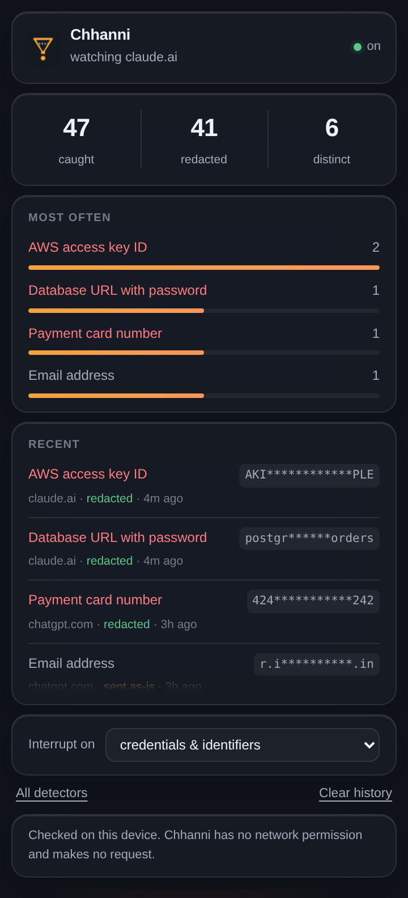
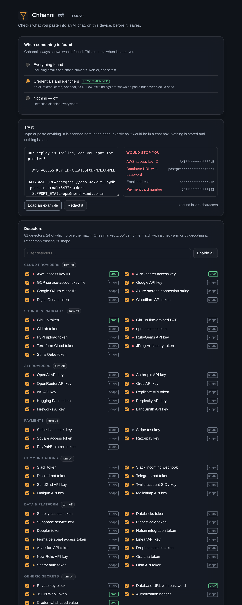

# Chhanni

**छन्नी** — *a sieve*.

A sieve for everything you paste into an AI.

> Your prompt leaves your machine the instant you press Enter. Chhanni looks at
> it first, on your device, and tells you what you are about to hand over.

**99.88% precision · 99.54% recall · 81 detectors · zero network permission**

---

## The problem, stated plainly

People paste production config into chat boxes. Not careless people — tired
people, at 11pm, debugging something. The fastest way to get help with a broken
deploy is to paste the whole `.env` and the whole stack trace, and that is
exactly what everyone does.

Samsung banned ChatGPT internally after engineers pasted source code into it.
Every company since has written a policy about this. A policy is not a control.

## What it does

```console
$ chhanni scan worker.txt

  :3     critical AWS access key ID            AKI************PLE
         Long-lived IAM key for AWS account 5810-3995-4779 — decoded offline from the key itself.
  :4     critical Database URL with password   postgr************orders
         postgres credentials, including the host.
  :5     critical Razorpay key                 rzp************x4Y
  :8     medium   GSTIN                        27A*********1ZV
         Check character verified mod 36.
  :8     medium   UPI ID                       ram***********ank
  :9     critical Payment card number          424************242
         Visa, passes Luhn and a live issuer range.
  :9     high     Indian PAN                   ABC****34E
  :10    medium   IMEI                         490*********518

blocked 8 in 1 file
```

The same file also contained a git SHA, a 16-digit order number, a UUID and an
epoch timestamp. **None of them were reported.** That is the entire product.


## Measured, not asserted

Every product in this category claims accuracy. None of them publish a number.

The only public figures come from academic work on secret scanners
([Rahman et al., 2023](https://arxiv.org/pdf/2307.00714)):

| Tool | Precision | Recall |
|---|---|---|
| GitHub Secret Scanner | 75% | — |
| Gitleaks | 46% | 88% |
| SpectralOps | — | 67% |
| TruffleHog | — | 52% |
| "Commercial X" | 25% | — |
| **Chhanni** | **99.88%** | **99.54%** |

No tool in that study has both. Reproduce ours in one command:

```console
$ node bench/run.js
  precision   100.0%   241 true / 0 false positives
  recall      100.0%   0 missed
  46,206 byte document scanned in 2.97ms (15.6 MB/s), 81 detectors
```

4,247 cases across ten seeds. The corpus is generated from a seeded PRNG, so no
real credential is committed here and every figure is reproducible with
`--seed N`. Method, per-seed table, and **what the numbers do not say** are in
**[docs/BENCHMARK.md](docs/BENCHMARK.md)** — including the honest limit: a check
digit can never reach zero false positives, because roughly 1 in 10 random
numbers of the right length passes one.

Not comparable to the table above, which uses real repositories. Ours is
synthetic and prompt-shaped.

## This idea is not new

**[Casper](https://arxiv.org/abs/2408.07004)** (arXiv 2408.07004) published this
architecture in 2024. Nightfall and LayerX sell it; **LayerX was acquired by
Akamai for ~$205M in July 2026**. A project that pretends to be first is lying
about the one thing you cannot check.

Where there is actually room — and what this project lacks compared to them,
including its missing ML/NER layer — is in
**[docs/PRIOR-ART.md](docs/PRIOR-ART.md)**.

## Why this isn't just regexes

Because a tool that cries wolf gets turned off, and there is only one way to
stop crying wolf: make the match prove itself.

| Detector | The proof |
|---|---|
| AWS access key | **base32 decode** recovers the account number *from the key itself* |
| Payment card | **Luhn** *and* a live **issuer range** at a length that network issues |
| Aadhaar | **Verhoeff** check digit, plus reserved first-digit rules |
| GSTIN | **mod-36** check character and a valid state code |
| IBAN | **mod-97** |
| GitHub token | **CRC32** carried in the token's own last 6 characters |
| JWT | base64-decodes the header; **`alg:none` escalates to critical** |
| CPF / CNPJ | two **mod-11** check digits |
| ABN / TFN | weighted **mod 89** / **mod 11** |
| ISIN | **Luhn** over letter-expanded ordinals |
| US SSN | never-issued area, group and serial ranges |
| AWS secret | entropy ≥ 4.2, a credential word within 48 chars, and not a hex digest |

**81 detectors. 24 of them prove the match rather than trusting its shape.**

The other 57 match a prefix nothing else uses — `AKIA`, `xoxb-`, `ghp_` — which
is strong but is not proof, and is labelled `shape` rather than `proof`
everywhere it appears. `chhanni rules` prints the method for every detector that
has one.

Four more layers do the rest of the precision work: **benign-shape rejection**
(UUIDs, hex digests, epoch timestamps, repeated and sequential runs, and
documentation placeholders like `API_KEY=your-api-key-here`), **required context
words** for identifiers with no distinctive shape (nine digits are nine digits
until something says "SIN"), **overlap resolution**, and **prefilters**.

## Redact, don't block

A blocker gets uninstalled the first time it stands between someone and their
deadline. So the primary button is not *cancel* — it is **redact and continue**:

```
  AWS_ACCESS_KEY_ID=<AWS_ACCESS_KEY_ID_1>
  DATABASE_URL=<DB_CONNECTION_STRING_1>
  card <PAYMENT_CARD_1>, PAN <PAN_INDIA_1>
```

The prompt still works. The model never needed your real key to explain a stack
trace. Placeholders are stable within a document — the same secret three times
becomes the same token three times — so the model can still reason about "the
key on line 4".

## It reads your attachments too

The gap every tool in this category documents and most leave open: people do not
only paste secrets, they **attach** them. A dragged `.env` never touches the
composer, so a composer-only scanner sees nothing.

Chhanni intercepts both drops and file pickers, reads text-like files locally,
and offers something no other tool does — **attach a redacted copy instead**. A
new `File` with the same name and type, secrets replaced with placeholders, and
everything the model needs to actually help you left intact.

## What it looks like

| Toolbar popup | Settings |
|---|---|
|  |  |

Surfaces are real glass — `backdrop-filter` over the page beneath, hairline
borders, an inner highlight along the top edge and layered contact-plus-ambient
shadows — because the panel appears unannounced over someone's work, and a
translucent layer reads as something placed *on* the page rather than part of
it. Where `backdrop-filter` is unavailable an `@supports` fallback goes opaque,
so text never lands on an unreadable background.

The popup answers the only question a security tool must answer well — *is this
doing anything?* — with what it caught, which detectors fire most, and how many
**distinct** secrets that represents, since pasting the same key six times is
one mistake repeated.

The settings page carries a live playground: type anything, see what fires and
what verdict it produces, before trusting it with something real.

These screenshots are generated, not mocked. `scripts/render-ui.mjs` drives real
Chromium, fires a real paste at the real content script, clicks *Redact and
continue*, and asserts the composer comes back clean. It has caught two bugs the
unit tests could not — a CSS specificity mistake where `all: unset`
out-specified the primary button's own styles, and a heading that enumerated
every finding and pushed the findings below the fold.

## System design

- **[docs/ARCHITECTURE.md](docs/ARCHITECTURE.md)** — the layered module graph,
  both interception flows, writing back into React- and ProseMirror-controlled
  composers, the storage split, and what scanning costs.
- **[docs/THREAT-MODEL.md](docs/THREAT-MODEL.md)** — trust boundaries, seven
  threats with mitigations, and an explicit not-covered list. The primary
  adversary is the user's own hurry.
- **[docs/BENCHMARK.md](docs/BENCHMARK.md)** — method, per-seed results, and the
  limits of the claim.
- **[docs/PRIOR-ART.md](docs/PRIOR-ART.md)** — who did this first, who sells it,
  and what this project does not have.
- **[docs/DECISIONS.md](docs/DECISIONS.md)** — decision records, each with its cost.

## It makes no network call

Not "we don't store your data". There is no `fetch` in the extension. The
manifest requests no network permission — only `storage`, for your settings. A
tool that inspects your credentials has no business holding a network handle.

A test fails the build if any shipped module references `fetch`,
`XMLHttpRequest`, `sendBeacon`, `WebSocket` or `EventSource`, and a second
asserts `permissions === ['storage']`. Findings carry a masked `preview` and a
one-way FNV-1a `fingerprint`; `--json` strips the matched value entirely.
Someone will fork this and add telemetry; the fork should be safe by
construction.

## Install

```console
git clone <this repo> && cd chhanni
node scripts/build-extension.js     # copies the engine in; no bundler, no deps
```

`chrome://extensions` → Developer mode → **Load unpacked** → pick `extension/`.

**CLI** — no install, no dependencies:

```console
node bin/chhanni.js scan .          # exit 0 clean, 1 findings, 2 blocking
node bin/chhanni.js redact < prompt.txt
node bin/chhanni.js rules
node bench/run.js --failures
```

```sh
# .git/hooks/pre-commit
git diff --cached --name-only -z | xargs -0 node bin/chhanni.js scan --quiet
```

**Library**: `import { scan, redact } from 'chhanni'`. Zero runtime
dependencies, Node ≥ 20, same module runs in the browser.

## What it does not do

- **No ML or NER layer.** Unstructured PII in prose — a name, an address, a
  medical detail — is invisible to a pattern engine. Casper has one; this does
  not. Largest gap, and it is not close.
- **It matches formats, not meaning.** Describing unreleased pricing in careful
  prose is a leak nothing pattern-based can see.
- **Only the sites in the manifest.** A new AI product ships every week.
- **Binary attachments** are skipped — a screenshot of your dashboard is not read.
- **Novel credential formats** fall through to the entropy rule, which needs a
  credential-ish word nearby.
- **It is advisory.** "Send as-is" exists on purpose. This is a guardrail, not
  an enterprise DLP control, and should not be sold as one.

## Tests

```console
$ node --test test/*.test.js
# tests 39
# pass 39
```

Checksums against known-good and known-bad vectors, true positives per
credential family, explicit false-positive tests, a prefilter-equivalence test
proving the speed optimisation never changes results, and a benchmark gate that
fails below 99% precision or recall.

One caution the benchmark alone cannot give you: the GSTIN validator once had an
off-by-one that rejected every real GSTIN, and the benchmark scored **100%**
throughout — because the corpus generator called the same broken function.
Only a known-good published GSTIN caught it.

## Layout

```
src/checksums.js      Luhn, Verhoeff, mod-97, CRC32, entropy, issuer ranges
src/identifiers.js    national IDs + AWS account decoding — imports nothing
src/negatives.js      benign shapes: UUIDs, digests, epochs, placeholders
src/rules.js          the 81 detectors, with prefilters, categories and proofs
src/detect.js         scanning, overlap resolution, masking, fingerprinting
src/redact.js         stable placeholders, reversible
bin/chhanni.js        CLI
bench/                seeded corpus and the scoring harness
extension/content.js  paste, submit and attachment interception; the panel
extension/popup.*     toolbar dashboard
extension/options.*   settings and the live playground
scripts/              build, icon generation, visual + end-to-end verification
docs/                 architecture, threat model, benchmark, prior art, decisions
test/                 node:test, no runner to install
```

## Licence

MIT.
